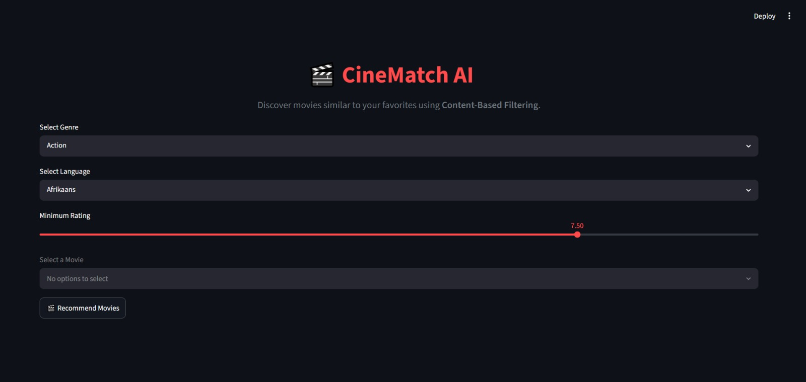
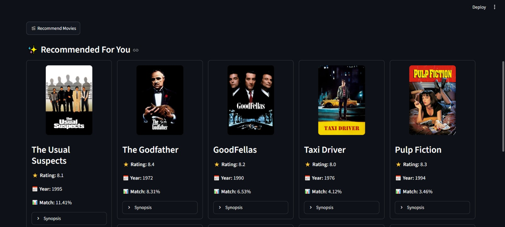
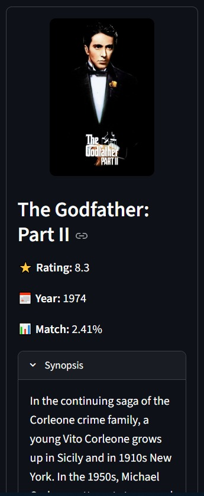

# 🎬 AI Movie Recommendation System

An AI-powered movie recommendation web application built with **Python**, **Streamlit**, and **Scikit-learn**. The system uses **Content-Based Filtering** with **TF-IDF Vectorization** and **Cosine Similarity** to recommend movies similar to a user's selected movie.

Movie posters are dynamically fetched using the **TMDB API**, providing a modern and interactive user experience.

---

## 🚀 Features

- 🎭 Filter movies by genre
- 🌍 Filter by language
- ⭐ Set minimum movie rating
- 🔍 Search and select a movie
- 🤖 AI-powered content-based recommendations
- 📊 Similarity score for each recommendation
- 🖼️ Movie posters fetched from TMDB API
- 📖 Movie synopsis for recommended movies
- 🎨 Interactive Streamlit interface

---

## 📸 Screenshots

### 🏠 Home Page



---

### 🎬 AI Recommendations



---

### 📖 Movie Synopsis



---

## 🧠 Recommendation Algorithm

This project uses a **Content-Based Recommendation System**.

### Steps

1. Clean and preprocess the TMDB movie dataset.
2. Combine movie:
   - Genres
   - Keywords
   - Overview
3. Create a unified **tags** feature.
4. Convert tags into numerical vectors using **TF-IDF Vectorization**.
5. Compute similarity between all movies using **Cosine Similarity**.
6. Filter movies based on:
   - Genre
   - Language
   - Minimum Rating
7. Recommend the Top 10 most similar movies.

---

## 🏗️ Project Structure

```
AI-Movie-Recommendation-System/
│
├── app.py                     # Streamlit application
├── recommendation.py          # Recommendation engine
├── data_preprocessing.py      # Dataset cleaning & preprocessing
├── requirements.txt
├── .env                       # TMDB API Key (Not included)
│
├── data/
│   ├── tmdb_5000_movies.csv
│   └── clean_movies.csv
│
└── README.md
```

---

## 📊 Dataset

This project uses the **TMDB 5000 Movies Dataset**.

Dataset includes:

- Movie Title
- Genres
- Keywords
- Overview
- Language
- Rating
- Popularity
- Runtime
- Release Year

---

## 🛠️ Technologies Used

- Python
- Streamlit
- Pandas
- Scikit-learn
- Requests
- Python Dotenv
- TMDB API

---

## ⚙️ Installation

### Clone the repository

```bash
git clone https://github.com/your-username/AI-Movie-Recommendation-System.git

cd AI-Movie-Recommendation-System
```

### Create a virtual environment

```bash
python -m venv venv
```

### Activate the environment

Windows

```bash
venv\Scripts\activate
```

Mac/Linux

```bash
source venv/bin/activate
```

### Install dependencies

```bash
pip install -r requirements.txt
```

---

## 🔑 TMDB API Setup

Create a `.env` file in the project root.

```text
TMDB_API_KEY=YOUR_API_KEY
```

Get your API key from:

https://www.themoviedb.org/settings/api

---

## ▶️ Run the Application

```bash
streamlit run app.py
```

## 🎯 How It Works

1. Select a movie genre.
2. Select language.
3. Choose a minimum rating.
4. Pick a movie from the filtered list.
5. Click **Get Recommendations**.
6. The application recommends the most similar movies along with:
   - Poster
   - Rating
   - Release Year
   - Similarity Score
   - Synopsis

---

## 🔮 Future Improvements

- ❤️ Favorite Movies
- ⭐ User Ratings
- 👤 User Authentication
- 🎥 Movie Trailers
- 📱 Responsive UI
- 🔥 Trending Movies
- 🎬 Similar Movies API Integration
- 🧠 Hybrid Recommendation System

---